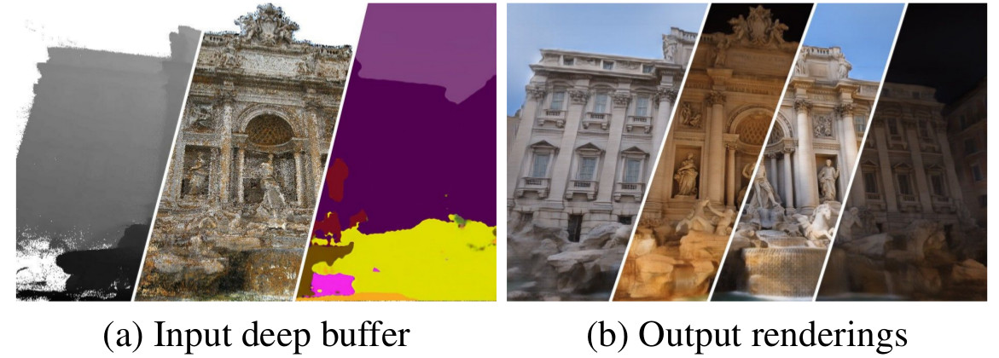
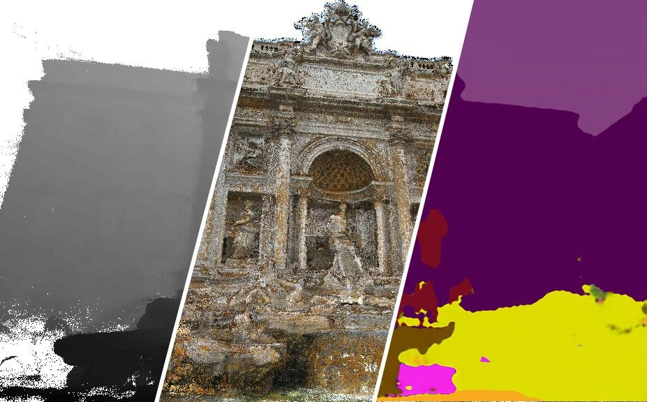
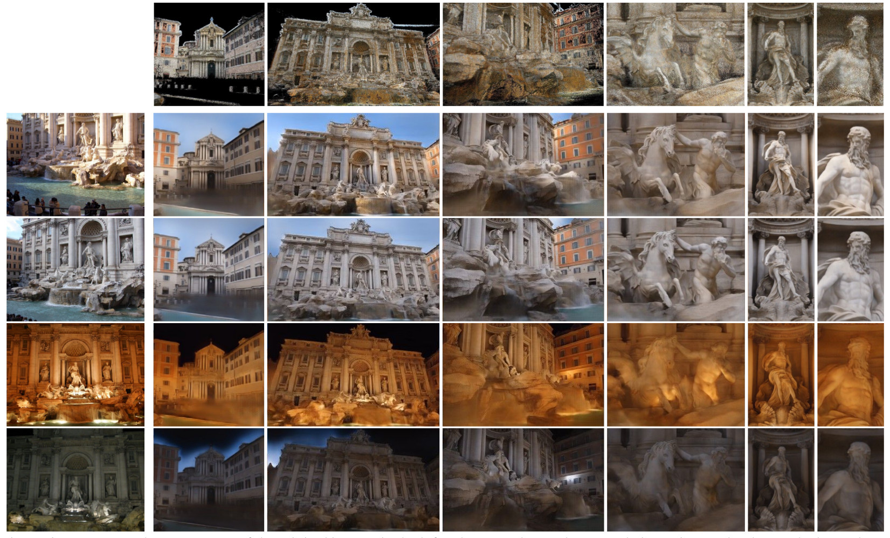
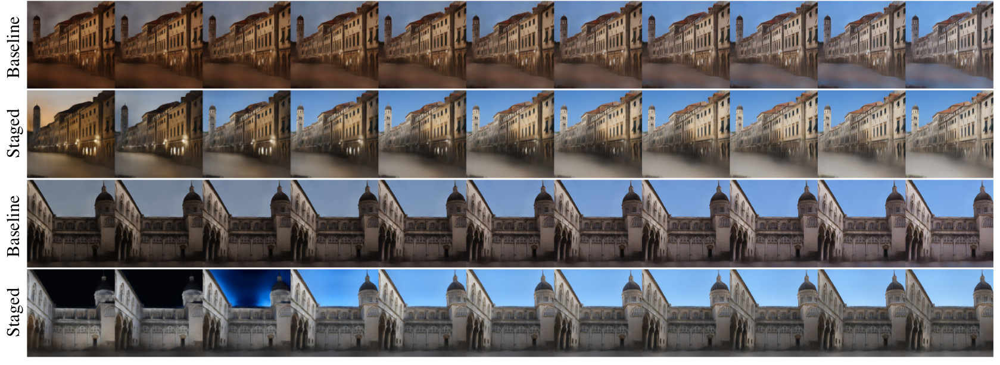

# Neural Rerendering in the Wild
Moustafa Meshry<sup>1</sup>, 
[Dan B Goldman](http://www.danbgoldman.com/)<sup>2</sup>, 
[Sameh Khamis](http://www.samehkhamis.com/)<sup>2</sup>, 
[Hugues Hoppe](http://hhoppe.com/)<sup>2</sup>, 
Rohit Pandey<sup>2</sup>, 
[Noah Snavely](http://www.cs.cornell.edu/~snavely/)<sup>2</sup>, 
[Ricardo Martin-Brualla](http://www.ricardomartinbrualla.com/)<sup>2</sup>.

<sup>1</sup>University of Maryland, College Park &nbsp;&nbsp;&nbsp;&nbsp; <sup>2</sup>Google Inc.

To appear at CVPR 2019 (Oral). <br><br>


<figure class="image">
  <!---  --->
  
</figure>

<!---  --->
                                                                                                                                              
We will provide Tensorflow implementation and pretrained models for our paper soon.

[**Paper**](https://128.84.21.199/pdf/1904.04290.pdf) | [**Video**](https://www.youtube.com/watch?v=E1crWQn_kmY) | [**Code**](https://github.com/MoustafaMeshry/neural_rerendering_in_the_wild) | [**Project page**](https://moustafameshry.github.io/neural_rerendering_in_the_wild/)

### Abstract

We explore total scene capture — recording, modeling, and rerendering a scene under varying appearance such as season and time of day.
Starting from internet photos of a tourist landmark, we apply traditional 3D reconstruction to register the photos and approximate the scene as a point cloud.
For each photo, we render the scene points into a deep framebuffer,
and train a neural network to learn the mapping of these initial renderings to the actual photos.
This rerendering network also takes as input a latent appearance vector and a semantic mask indicating the location of transient objects like pedestrians.
The model is evaluated on several datasets of publicly available images spanning a broad range of illumination conditions.
We create short videos demonstrating realistic manipulation of the image viewpoint, appearance, and semantic labeling.
We also compare results with prior work on scene reconstruction from internet photos.

### Video
[](https://www.youtube.com/watch?v=E1crWQn_kmY)

<!---
### Paper
--->

<!---
### Results
<figure class="image">
  
  <figcaption>(a) Input deep buffer</figcaption>
  
  <figcaption>(b) Output rerenderings</figcaption>
</figure>
<figure class="image">
  
</figure>
--->
                                                        
### Appearance variation
<figure class="image">
  
</figure>
<!--- [![app_variation] (https://github.com/MoustafaMeshry/neural_rerendering_in_the_wild/blob/master/imgs/app_variatoin.jpg?raw=true | width=900)] --->

### Appearance interpolation
<figure class="image">
  
</figure>
<!--- [![app_interpolation] (https://github.com/MoustafaMeshry/neural_rerendering_in_the_wild/blob/master/imgs/app_interpolation.jpg?raw=true | width=900)] --->

### Acknowledgements
We thank Gregory Blascovich for his help in conducting the user study, and Johannes Schönberger and True Price for their help generating datasets.

### Run and train instructions

Staged-training consists of three stages:

-   Pretraining the appearance network.
-   Training the rendering network while fixing the weights for the appearance
    network.
-   Finetuning both the appearance and the rendering networks.

### Aligned dataset preprocessing

#### Manual preparation

*   Set a path to a base_dir that contains the source code:

```
base_dir=//to/neural_rendering
mkdir $base_dir
cd $base_dir
```

*   We assume the following format for an aligned dataset:
    * Each training image contains 3 file with the following nameing format:
        * real image: %04d_reference.png
        * render color: %04d_color.png
        * render depth: %04d_depth.png
*   Set dataset name: e.g.
```
dataset_name='trevi3k'  # set to any name
```
*   Split the dataset into train and validation sets in two subdirectories:
    *   $base_dir/datasets/$dataset_name/train
    *   $base_dir/datasets/$dataset_name/val
*   Download the DeepLab semantic segmentation model trained on the ADE20K
    dataset from this link:
    http://download.tensorflow.org/models/deeplabv3_xception_ade20k_train_2018_05_29.tar.gz
*   Unzip the downloaded file to: $base_dir/deeplabv3_xception_ade20k_train
*   Download trained weights for the vgg network as instructed in this link:
https://github.com/machrisaa/tensorflow-vgg
*   Save the vgg weights to $base_dir/vgg16_weights/vgg16.npy


#### Data preprocessing

*   Run the preprocessing pipeline which consists of:
    *   Filtering out sparse renders.
    *   Semantic segmentation of ground truth images.
    *   Exporting the dataset to tfrecord format.

```
# Run locally
python tools/dataset_utils.py \
--dataset_name=$dataset_name \
--dataset_parent_dir=$base_dir/datasets/$dataset_name \
--output_dir=$base_dir/datasets/$dataset_name \
--xception_frozen_graph_path=$base_dir/deeplabv3_xception_ade20k_train/frozen_inference_graph.pb \
--alsologtostderr
```

### Pretraining the appearance encoder network

```
# Run locally
python pretrain_appearance.py \
  --dataset_name=$dataset_name \
  --train_dir=$base_dir/train_models/$dataset_name-app_pretrain \
  --imageset_dir=$base_dir/datasets/$dataset_name/train \
  --train_resolution=512 \
  --metadata_output_dir=$base_dir/datasets/$dataset_name
```

### Training the rerendering network with a fixed appearance encoder

Set the dataset_parent_dir variable below to point to the directory containing
the generated TFRecords.

```
# Run locally:
dataset_parent_dir=$base_dir/datasets/$dataset_name
train_dir=$base_dir/train_models/$dataset_name-staged-fixed_appearance
load_pretrained_app_encoder=true
appearance_pretrain_dir=$base_dir/train_models/$dataset_name-app_pretrain
load_from_another_ckpt=false
fixed_appearance_train_dir=''
train_app_encoder=false

python neural_rerendering.py \
--dataset_name=$dataset_name \
--dataset_parent_dir=$dataset_parent_dir \
--train_dir=$train_dir \
--load_pretrained_app_encoder=$load_pretrained_app_encoder \
--appearance_pretrain_dir=$appearance_pretrain_dir \
--train_app_encoder=$train_app_encoder \
--load_from_another_ckpt=$load_from_another_ckpt \
--fixed_appearance_train_dir=$fixed_appearance_train_dir \
--total_kimg=4000
```

### Finetuning the rerendering network and the appearance encoder

Set the fixed_appearance_train_dir to the train directory from the previous
step.

```
# Run locally:
dataset_parent_dir=$base_dir/datasets/$dataset_name
train_dir=$base_dir/train_models/$dataset_name-staged-finetune_appearance
load_pretrained_app_encoder=false
appearance_pretrain_dir=''
load_from_another_ckpt=true
fixed_appearance_train_dir=$base_dir/train_models/$dataset_name-staged-fixed_appearance
train_app_encoder=true

python neural_rerendering.py \
--dataset_name=$dataset_name \
--dataset_parent_dir=$dataset_parent_dir \
--train_dir=$train_dir \
--load_pretrained_app_encoder=$load_pretrained_app_encoder \
--appearance_pretrain_dir=$appearance_pretrain_dir \
--train_app_encoder=$train_app_encoder \
--load_from_another_ckpt=$load_from_another_ckpt \
--fixed_appearance_train_dir=$fixed_appearance_train_dir \
--total_kimg=4000
```


### Evaluate model on validation set

```
experiment_title=$dataset_name-staged-finetune_appearance
local_train_dir=$base_dir/train_models/$experiment_title
dataset_parent_dir=$base_dir/datasets/$dataset_name
val_set_out_dir=$local_train_dir/val_set_output

# Run the model on validation set
echo "Evaluating the validation set"
python neural_rerendering.py \
      --train_dir=$local_train_dir \
      --dataset_name=$dataset_name \
      --dataset_parent_dir=$dataset_parent_dir \
      --run_mode='eval_subset' \
      --virtual_seq_name='val' \
      --output_validation_dir=$val_set_out_dir \
      --logtostderr
# Evaluate quantitative metrics
python evaluate_quantitative_metrics.py \
      --val_set_out_dir=$val_set_out_dir \
      --experiment_title=$experiment_title \
      --logtostderr
```
